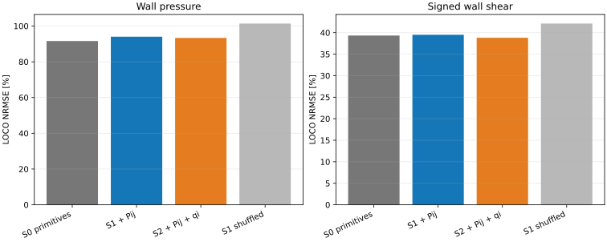

# SPARTA moment-sufficiency pilot gate

**Verdict: FAIL**

The four DSMC blocks were averaged before training and were used only to estimate sampling uncertainty. All scores are leave-one-complete-geometry-out (LOCO); no wall element from the held geometry enters training.

Training/evaluation support: `nearfield` (`0.10 <= x <= 0.40 m`, including every protrusion element).

| Region | Target | S0 NRMSE | S1 NRMSE | S2 NRMSE | S1 shuffled | S1 gain | 95% CI | DSMC block SEM |
|---|---:|---:|---:|---:|---:|---:|---:|---:|
| nearfield | cp | 91.62% | 94.04% | 93.34% | 101.38% | -2.63% | [-5.17, 2.02]% | 2.64% |
| nearfield | cf | 39.33% | 39.51% | 38.82% | 42.11% | -0.45% | [-4.30, 7.88]% | 6.99% |
| protrusion | cp | 114.51% | 117.73% | 116.90% | 104.03% | -2.81% | [-5.32, 1.99]% | 1.91% |
| protrusion | cf | 79.17% | 79.75% | 78.26% | 73.29% | -0.73% | [-4.72, 8.81]% | 6.24% |

## Gate checks

- FAIL: `relative_gain_at_least_20_percent`
- FAIL: `bootstrap_ci_excludes_zero`
- FAIL: `gain_exceeds_block_uncertainty`
- PASS: `aligned_beats_shuffled`
- FAIL: `gain_positive_for_every_held_geometry`

Held-geometry signed-shear gains:

- BWD: -2.01%
- FWD: 8.22%
- ISO: -4.86%

## Structural notes

- All six cases contain four aligned grid and wall blocks and finite numeric values.
- BWD has 88,001 grid rows because parent cell 4980 is split into two cut-cell subcells; `id+split` is stable across all blocks.
- The data are stock-SPARTA reproductions of the archived parameter slice, not restart continuations of the private FPPC runs.
- Surface tallies are targets only. The model samples bulk moments at 0.5, 1, and 2 mean-free-path distances along the gas-facing normal.
- Case-level bootstrap resampling is intentionally conservative because only six statistically distinct cases are available.

