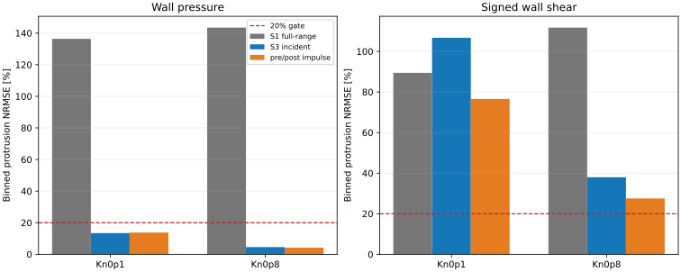
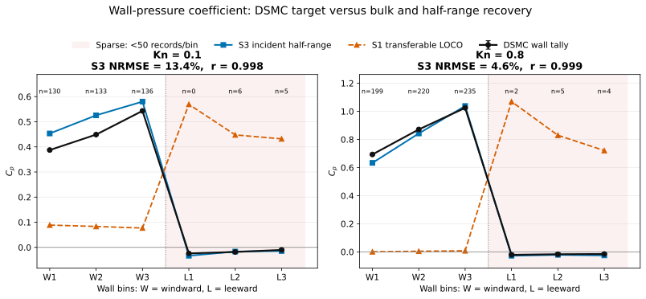

# Incident half-range diagnostic

**Verdict: INCONCLUSIVE**

SPARTA collision tallies are instantaneous: each dump contains collisions from its current timestep only. The uploaded files therefore contain ten sampled timesteps per case, not 200 accumulated timesteps.

The S3 incident reconstruction uses pre-collision velocity plus the known fully diffuse 300 K wall kernel. Post-collision velocity is used only as an impulse-reconstruction control.

| Case | Records | Covered elements | Min/bin | Target | S1 LOCO | S3 incident | Full impulse | Correlation S3 |
|---|---:|---:|---:|---|---:|---:|---:|---:|
| ISO_Ma6_Kn0p1 | 410 | 38/60 | 0 | cp | 136.4% | 13.4% | 13.7% | 0.998 |
| ISO_Ma6_Kn0p1 | 410 | 38/60 | 0 | cf | 89.5% | 106.7% | 76.6% | 0.794 |
| ISO_Ma6_Kn0p1 | 410 | 38/60 | 0 | cq | n/a | 23.7% | 23.0% | 0.992 |
| ISO_Ma6_Kn0p8 | 665 | 40/60 | 2 | cp | 143.5% | 4.6% | 4.2% | 0.999 |
| ISO_Ma6_Kn0p8 | 665 | 40/60 | 2 | cf | 111.7% | 38.0% | 27.5% | 0.995 |
| ISO_Ma6_Kn0p8 | 665 | 40/60 | 2 | cq | n/a | 10.7% | 11.3% | 0.992 |

## Decision

- PASS: pressure profile recovered from incident half-range data.
- FAIL: signed shear recovered below the 20% NRMSE threshold.
- FAIL: every 10-element bin has at least 50 collision records.

Pressure strongly supports the half-range hypothesis, but the current ten-timestep collision sample is too sparse to decide signed shear. Continue only the two existing ISO restarts with every-timestep collision output.

The pressure result is already a strong positive control: S3 reduces the ISO protrusion pressure error from roughly 136-143% for transferable S1 to 4-13%. The shear conclusion is not yet identifiable because several surface bins have zero or only a few collision records.

## Direct wall-pressure profile check

The pressure conclusion is also visible directly in the binned wall profile, not only in the aggregate error bars. On the collision-rich windward face, the incident S3 reconstruction has 13.4% NRMSE at Kn=0.1 and 4.5% at Kn=0.8. These are essentially unchanged from the all-bin values of 13.4% and 4.6%, respectively. Thus the apparent pressure recovery is not created by the sparse leeward bins.

The transferable S1 baseline predicts the pressure rise on the wrong face, whereas S3 follows both the magnitude and the windward-to-leeward discontinuity of the DSMC wall tally. The red-shaded leeward face has fewer than 50 collision records per bin in the uploaded ten-timestep sample and remains a coverage warning until the long continuation finishes.

